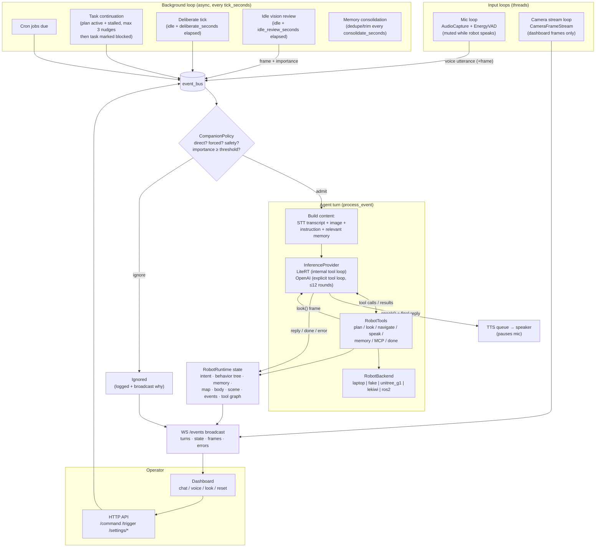

# Architecture

Actum is a robot runtime first and an agent framework integration point second.

## Why Not Put an Agent Framework at the Center?

Agent frameworks are useful for orchestration, tool routing, memory, MCP servers, and multi-agent workflows. They are not the right owner for physical safety, robot state, embodiment limits, or low-level action contracts.

The project therefore uses this split:

- **Core runtime owns:** robot state, capabilities, intent, memory, companion policy, event log, tool graph, backend actions, safety policy.
- **Adapters expose:** MCP tools, ROS 2 interfaces, LeRobot policies, web dashboard, CLI.

This keeps the robot dependable even if the agent framework changes.

## Runtime Layers

1. `RobotBackend`
   - Connects to physical or simulated robots.
   - Returns typed `ActionResult` and `RobotState`.
   - Current adapters: `laptop`, `fake`, `unitree_g1`, `lekiwi`.

2. `RobotRuntime`
   - Holds backend, `IntentState`, `BehaviorTreeState`, `MemoryStore`, `CompanionPolicy`, `EventLog`, capability registry, cron jobs, live map, body perception, settings, and tool graph.
   - Provides a serializable snapshot for dashboard and future MCP/ROS bridges.

3. `RobotTools`
   - LLM-visible tools.
   - Calls the runtime/backend instead of hardware directly.

4. `RobotAgent`
   - Owns the LLM conversation and speech/camera event loop.
   - Produces operator-visible intent with `set_plan`, `mark_step`, and `done`.
   - Runs a background autonomy loop for waiting/perception ticks and scheduled jobs.
   - Uses the companion policy to decide whether passive vision/timer/cron events should reach the LLM.

5. Laptop companion backend
   - Provides local webcam, microphone, speaker, direct web fetch, and optional MCP tool access.
   - Refuses motion/manipulation calls because a laptop is stationary.

6. Dashboard
   - Shows triggers, camera, action trace, plan/intent, behavior tree, memory, live map, body perception, robot/backend settings, model/tool settings, and tool graph.
   - Built as a React/Tailwind frontend in `frontend/`, served from `frontend/dist` by the FastAPI server.

## Runtime Loops

Five loops run concurrently. Everything that wants the LLM's attention goes through one
funnel: the `event_bus` → companion gate → agent turn. Nothing else may touch the model.



Loop cadences come from the active speed profile: `tick_seconds` drives the background
loop, `idle_review_seconds` the vision review, `deliberate_seconds` the self-tasking
tick, and `camera_fps` the dashboard stream. A conversation reset
(`POST /conversation/reset`) clears the provider history and live intent but keeps
durable memory, the event log, and the tool graph.

## Framework Strategy

Preferred integration order:

1. **LeRobot** for robot datasets, policy training, policy rollout, LeKiwi, and Unitree G1 policy paths.
2. **ROS 2** for teams that already depend on Nav2, MoveIt, TF, action servers, or robot-specific drivers.
3. **MCP** as an external control surface over Actum capabilities and as a trusted adapter for software/data tools.
4. Optional higher-level agent frameworks only as clients of MCP or as wrappers around `RobotRuntime`.

## Companion Strategy

Always-on does not mean always-acting.

Direct chat/language inputs are admitted by default. Passive vision, timer, cron, and loop events pass through `CompanionPolicy`, which admits events for safety relevance, explicit request language, high configured importance, or scheduled check-ins after a cooldown. Ignored events are still logged so the dashboard can explain why the robot stayed quiet.

The background loop keeps the public behavior tree alive even when there is no active task. It can sit on a waiting node, review idle camera frames, or enqueue scheduled instructions created by the agent with `schedule_job()`.

Personality lives in config, not code. The runtime exposes a public personality summary to the dashboard, and the agent prompt uses the configured name, persona, likes, principles, and speaking style.

## Memory Strategy

The current memory system is deliberately simple but layered:

- **Semantic facts** for stable preferences and facts such as names, dock locations, and user preferences.
- **People** for notes about who the robot has interacted with.
- **Places** for rooms, landmarks, docking stations, and work areas.
- **Spatial notes** for lightweight mapping facts such as "charging dock is left of the desk".
- **Episodes and observations** for completed turns and meaningful things the robot saw or did.

The default implementation is a JSON-backed `MemoryStore` at `data/memory.json`. It is enough for laptop development and keeps tests dependency-light. The important design point is the interface: richer storage can replace the file backend later, including SQLite for event history, vector search for semantic recall, and map/SLAM stores for robot localization.

The prompt receives only compact memory context. The durable store can be larger than the model context window, and retrieval/ranking should decide what enters each turn.

## Model Strategy

Use two classes of models:

1. **Executive models**
   - LLM/VLM used for language, planning, question answering, tool selection, and summarizing state.
   - Should emit structured intent and tool calls.

2. **Embodied policies**
   - VLA or imitation-learning policies used for short-horizon manipulation/navigation.
   - Should be invoked as capabilities with timeouts, safety checks, and validation.

Track these policy families:

- SmolVLA for efficient open VLA experiments on affordable hardware.
- pi0/pi0.5 through OpenPI for broader manipulation policy research.
- NVIDIA GR00T for humanoid policy direction, especially Unitree G1-style embodiments.
- OpenVLA for open-source VLA baselines and fine-tuning recipes.
- Gemini Robotics SDK if access is available and licensing fits.

## Safety Principle

Every physical action should pass through:

```
agent proposal -> capability schema -> safety supervisor -> backend action -> result -> observation
```

No agent framework, MCP client, or dashboard control should bypass this path.
